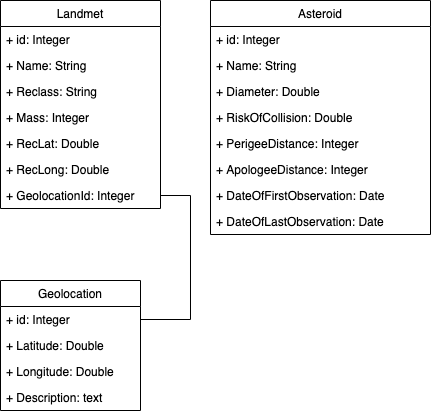
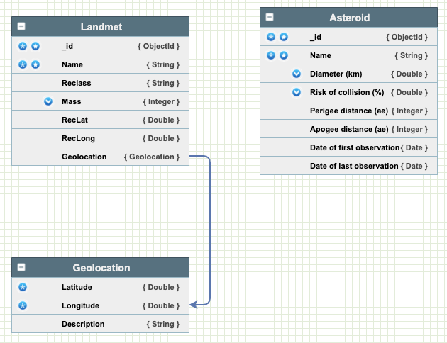

# Информация по докумантам

## Схема БД NoSQL

### SQL



### NoSQL



```json
{
    "_id": <ObjectId>,
    "name": "Aachen",
    "recclass": "L5",
    "mass": "21",
    "year": <Timestamp>,
    "reclat": "50.775000",
    "reclong": "6.083330",
    "geolocation": {
        "latitude": "50.775",
        "longitude": "6.08333"
    }
}
```

```json
{
    "_id": <ObjectId>,
    "name": "2010 PK9",
    "recclass": "L5",
    "diameter": "21",
    "risk_of_collision": 35.5,
    "perigee_distance": 1000,
    "apogree_distance": 500,
    "date_of_first_observation": <Timestamp>,
    "date_of_last_observation": <Timestamp>,
    "year": <Timestamp>
}
```

> Сайт создания: https://nosqldbm.ru/

## Список сущностей

В данном проекте осуществяется хранение и обработка данных для двух явлений: метеоритов и астероидов. 

> Метеорит - крупные метеорные тела, которые падают на Землю.

> Астероид - малые планеты - твёрдые небесные тела, которые значительно меньше планет по размеру. Движутся по орбитам.

### SQL

* **Landmet**:
  * `id` - уникальный идентификатор;
  * `Name` - название / имя метеорита;
  * `Reclass` (class) - класс метеорита;
  * `Mass` - масса;
  * `RecLat` - широна нахождения;
  * `RecLong` - долгота нахождения;
  * `GeolocationId` - локация падения с широтой и долготой.

* **Asteroid**:
  * `id` - уникальный идентификатор;
  * `Diameter` - диаметр;
  * `RiskOfCollision` - риск столкновения;
  * `PerigeeDistance` - расстояние Перегилия;
  * `ApologeeDistance` - апогейное расстояние;
  * `DateOfFirstObservation` - дата первого наблюдения;
  * `DateOfLastObservation` - дата последнего наблюдения.

* **Geolocation**:
  * `id` - уникальный идентификатор;
  * `Latitude` - ширина падения;
  * `Longitude` - долгота падения;
  * `Description` - описание падения.

### NoSQL (MongoDB)

Каждая сущность, как астероид, так и метеорит, представляют собой отдельные документы. Поле `Geolocation` у сущности `Landmet` является вложенным документом.

## Оценка объёма информации

Рассмотрим сущность `Landmet` для наглядности (наличие вложенного документа). Пусть совокупность полей `Name`, `Reclass`, `Mass`, `RecLat`, `RecLong` занимает N памяти, M - количество упавших метеоритов, а вложенный домент `Geolocation` (поля `Latitude`, `Longitude`, `Description`) - K.

Тогда для хранения данных будет занято:

* MongoDB: M * (N + K) = M * N + M * K
* SQL: M * N + * M * K

Тогда, согласно [документации](https://bsonspec.org/spec.html), N = 32 байт название (строка в UTF-8) + 64 байт масса + 32 байт класс + 32 * 2 (координаты) = 160 байт.
В реляционной БД результаты будут аналогичными.
Таким образом, кол-во **чистой памяти**, занимаемой реляционной БД, не отлечается от MongoDB.

Количество **памяти**, занимаемой MongoDB с учётом типа `<ObjectId>` (12 байт) и overhead (e_list + zero-termination) в 1 байт для каждого элемента = 12 + 5 + 160 = 177 байт.

Количество **памяти**, занимаемой реляционной БД с учётом полей `id` (4 байта): 4 байта * 4 id * 2 (с учётом ссылок) + 160 = 192 байт.

Таким образом, MongoDB выигрывает реляционной БД при **учёте всей информации, хранимой в моделе** (расчёты для одной запииси / документа).

Формула роста памяти для MongoDB при увеличении кол-ва моделей будет иметь вид: N * (12 + 5 + 160) = 177N, а для SQL: 192N.

Как следствие, использования MongoDB по памяти в данном случай будет эффективнее на 177/192.

## Запросы

* Запрос на поиск метеорита по `id` по всей коллекции (без учёта индексов) по местоположению:
  * MongoDB: O(M)
  * SQL DB: O(2M^2), т.к. необходимо сделать 2 раза операцию `JOIN` на таблицу `Geoposition`.

* Запросы на текущий момент осуществляются стандартным путём. (WIP)
